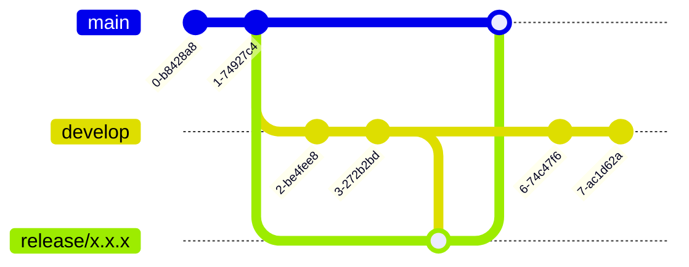

# CMS IS2-2023
Trabajo practico de la materia de **Ingenieria de Software 2**, Sistema de gestion de contenido.
## Integrantes
### Product Owner
Prof. Lic. Carolina Argüello
### Development Team
 - Francisco Sanabria
 - Jovana Alvarez
 - Jorge Maidana
 - Camila Maidana
  ## Requisitos
  * Docker
  * Python
 
 ## Montaje del proyecto
 1. Clonar el proyecto
 2. Agregar el archivo .env
	```env
	SECRET_KEY='secret'  
	DEBUG=1  
	  
	POSTGRES_NAME=""  
	POSTGRES_USER=""  
	POSTGRES_PASSWORD=""  
	POSTGRES_HOST=""  
	POSTGRES_PORT=""
	```
 4. Ejecutar el comando
	```bash
	docker-compose up --build  
	```
 
### Metodo de trabajo
Todo se mergea a develop, a partir de main se crea un release/x.x.x se mergea develop en release/x.x.x y por ultimo se mergea en main para produccion, y se crea el tag.
